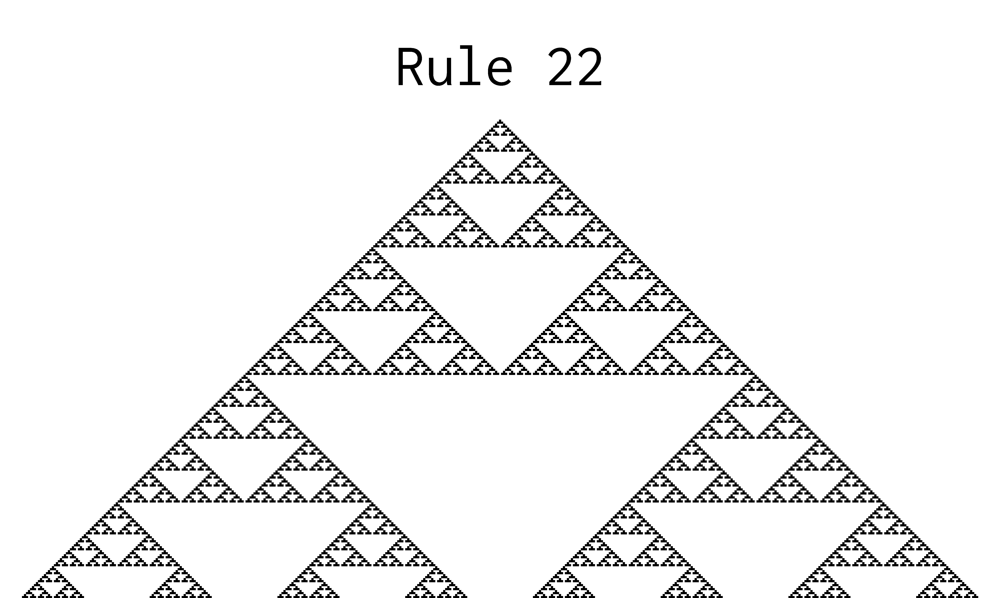

# Automata

Generates all 256 rules for 1d cellular automata; see [Weissteins's article on MathWorld](https://mathworld.wolfram.com/ElementaryCellularAutomaton.html).

Depencendies: Pillow.

Example, rule 22:

